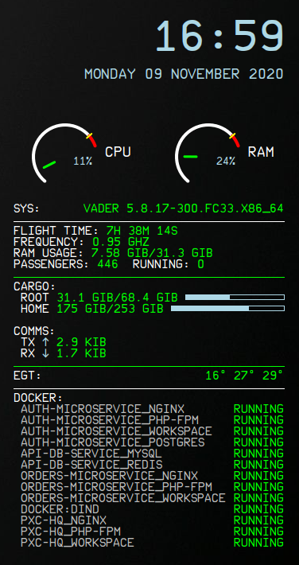

# A320NX_Conky

A [flybywire/a32nx](https://github.com/flybywiresim/a32nx) inspired conky theme.

After seeing the great work by flybywiresim and community I felt inspired to make this conky imitation ECAM screen for myself. Now I'm thinking others might like it, so here it is!

The font is from the a32nx project, except I have tweaked the underscore to look like an underscore again.

I have this installed at "~/.config/conky" however you can put wherever you wish, but if different, you will need to update the path to gauges.lua in conky.conf

